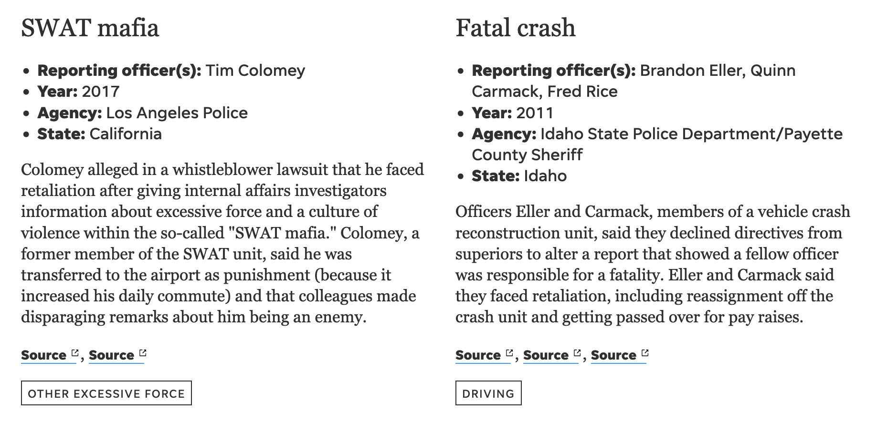

# What is a character?

This tool is intended to represent a group of entities. A character, in this documentation, means one entity. It could be a person, an agency, an organization or even a single incident. A cast of characters project collects many characters/entities.

## Parts of a basic character

In its simplest form, a character is a name with a text description. Characters can have optional images, titles and a few other _standard_ possibilities

## Adding characters

To begin filling out your information:

1. In the characters tab, each row represents one entry
2. The basic minimum needed are a name and description. Descriptions can be multiple paragraphs (two hard returns between paragraphs), but must be pasted into the single spreadsheet cell. 
3. Each additional piece of information for each entry (examples: Address, state, ""charges against"" or other features) should be added to their own colum. No matter how big or small, one piece of information per column.
				
Characters go in the `characters` tab. One row per character. Each cast of characters project can have it's own, custom format. This is expected (more on that in the discussion of the `columns` spreadsheet tab). There are a few basic elements

Column | Purpose | HTML/formatted text supported | Required
---|---|---|---
`name` | The character's name | No | Yes
`id` | A unique slug for the character. Must be lower case and only numbers, letters, hyphens or underscores | No | No
`title` | Appears under the name.  | No | No 
`description` | The main blurb | Yes | No 
`image` | Can be a Presto ID or a full CDN URL to an image. | No | No
`category` | If using categories, the category is assigned here with the category ID. | No | No 
`labels` | If using labels, assign them using list of label IDs, separated by semicolons.| No | No
`thumbnail` | Can be a Presto ID or a full CDN URL to an image. This image column is more flexible than `image` because the layout is not dependent on each character having one. If you have _some_ photos but not a lot, consider thumbnails. Like images, the aspect ratio for thumbnails can be set in the `top` spreadsheet tab. | No | No
`theme_color` | If set, any element in the character that uses the theme color will use this color instead. | No | No

!!! tip

    Good, descriptive alt text for images is not required here. The `name` field is used in its place.

### Draft mode to block characters

Each character can be set to a draft mode by adding a column `publish_status` and giving it a value of `draft`. These characters will not be published (to preview or public) and are 100% ignored. **The character will publish if any other value — even mispellings of 'draft` are used or if the column is omitted altogether.**

When to use: 

- Early data entry when you might not have all required information. You can still publish what you have. 
- Projects that publish over the course of several days. All characters should live in the `characters` spreadsheet tab, but can be enabled and published over the publication window by changing the draft status.

Column | Purpose | Required
---|---|---|---
`publish_status` | If set to `draft`, then the character will not publish.  | No

### Character add-ons

All character displays have a some slightly more advanced options.

Kicker | Rank badge | Thumbnail image
---|---|---
A small label above the name (not to be confused with proper character labels). Kickers are configured in the `columns` spreadsheet tab. | A small, circular icon suitable for displaying a ranking or grade. The circle picks up the specified theme color. Rank badges are configured in the `columns` spreadsheet tab. | A smaller image notched into the description. This is good for when you don't have a photo for more than just a couple of characters. Thumbnails should go into a`thumbnail` column in the `characters` spreadsheet tab.
 |  | 

## Customizing information 

Your cast of characters will display nicley with only the primary columns described above, but you are not limited to only those. No two stories have the same exact informational needs. Maybe, your public corruption story needs to highlight possible charges, pleas and legal outcomes for each character. Or perhaps your professional athlete ranking needs a blurb for each player's college career and a fun quote. 

You can add as many columns as you need. In fact, it is recommended that you add columns so that each cell only contains one item: a short blurb, a factoid, etc. Keeping your spreadsheet tab clean and structured will make it easier to handle.

### The columns tab

To customize the display of your information, use the `columns` tab of your spreadsheet. You have options for additional columns of data: 

1. **Bullets:** Simple factoids, such as age or hometown, can be collected into a bulleted list. 
2. **Blurbs:** Longer text items can be displayed as blurbs with optional headers underneath the main description (if used).
3. **Links:** Sometimes it makes sense to include a recirculation link with a character, or multiple links to source documents. One or more links are collected into a comma-separated list in the character. Full URLs or Presto IDs are accepted.
4. **Relative links:** Related links provided by Presto IDs, by default, will be directly to the originating news property. For example, a story made in the Indianapolis Presto will link to indystar.com, regardless of the news site the reader is on. Relative links will keep a reader on whatever news property they visited regardless of whichever Presto instance was used to write the articles. This will have no effect on direct links, which begin with `https://`.
4. **Kicker:** Kickers are small, all caps labels that appear above the character name. They are optional, and the contents of any character columm in the spreadsheet can populate that label. It is best if they are short (max 24 characters). There can be only one kicker, so if multiple columns are set to `kicker` then the last one in the list is what will be used. 
5. **Badge:** A badge is a small circle with enough room for 1-3 alphanumeric characters that is notched to the left of the name/title. They are good for ranked lists, as they give the ranking a little visual prominence. They also could be used as yet another means to categorize/label characters. Badges have no kicker. 

Blurbs | Bullets
---|---
 | 

!!! tip

    There is an opportunity to create an interesting cascade with multiple configured kickers: "If this column is filled, use it. If not, use this one, then this one then this one ....." Proceed with caution, though. It might be a terrible idea.

The order in which the bullets and blurbs appear will match the order of the rows in the spreadsheet. Custom `blurb` columns can use formatted text 

**Custom columns that are not configured in the `columns` tab will be ignored.** This means columns used for internal notes, links or references will not be published. 

Column | Purpose | Required
---|---|---
`column` | identity the column that your are configuring. This **must match** the column name.  | Yes
`type` | Must be `link`, `relative_link`, `blurb`, `kicker`, `badge` or `bullet` | No
`searchable` | When set to `yes`, the content of this column will be searchable through the text-search bar | No
`header` | This is a label for the column content. For type `blurb`, this text is used as a bold header. For type `bullet`, this text becomes a bold lead-in. For type `link` this is the link text. | No

## Different character layouts

The default layout for characters is very flexible and should handle most situations. There are two other layout options. Layouts are set in the `top` spreadsheet tab (for all characters) or in the `categories` tab (to make category-by-category choice).

Default | Medium layout | Wide layout
---|---|---
The standard layout will give you 3-4 characters across, as space allows.| For when you need a little extra room. The columns in the `medium` layout are a little wider. | Will display in a single column at all device widths. This layout is good for those times when you have a lot to say about each character
 |  | 
Example: [Most influential Black people in sports](https://www.usatoday.com/storytelling/grid/black-history-month-50-most-influential-black-people-in-sports/)| Example: [Blue Wall of Silence](https://www.usatoday.com/storytelling/grid/blue-wall-silence-police-whistleblower-misconduct-database/) | Example: [Jan. 6 rioters](https://www.usatoday.com/storytelling/capitol-riot-mob-arrests/)

### Flip-card layout

A radically different layout is the card design. Inspired by sports cards and social media images, this design features a large visual element and text, and can be flipped over (with a tap/click) to reveal more facts and figures. Like other layouts, a theme color can be set per character.

#### The visual side
The same paradigm for data organization used in the primary layouts applies here, too. Information should go into the `characters` spreadsheet tab, each in its own column. The cards use that same column configurations, too.

- `name`: Appears in the usual spot, above the caracter. This is not a card element in the layout.
- `title`: Appears alongside the name.
- `image`: The visual side of the card features this promintenly.
- `description`: Large display text on top of the visual. About 70-100 total characters will fit. Bolded text will display the theme color.

#### The text side

Bullets, blurb and links are supported, just like the other character layouts.

#### Card-specific options

Key | Purpose | default
---|---|---
`character_layout` | If set to `card`, then the flip card layout appears. If set to `card-reverse`, then the flip card with the text first is used. | `default`
`card_image_mask` | If set to `no`, then the semitransparent overlay is ommited from the image. | `yes`

### Side-by-side layout

Basically the same as the flip-card, but both sides of the card are simulataneously visible.

Key | Purpose | default
---|---|---
`character_layout` | If set to `card-side-by-side`, then that layout is used.`card-side-by-side-reverse` will flip the positions of the text and visual sides.

